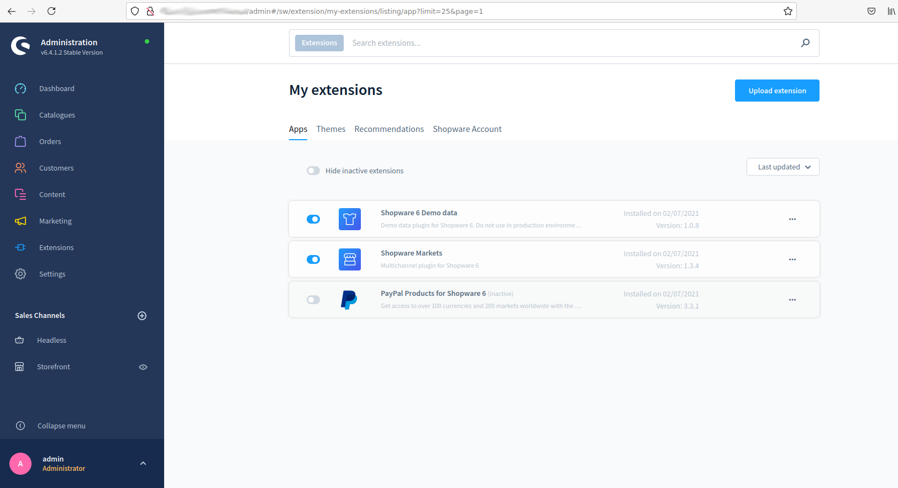
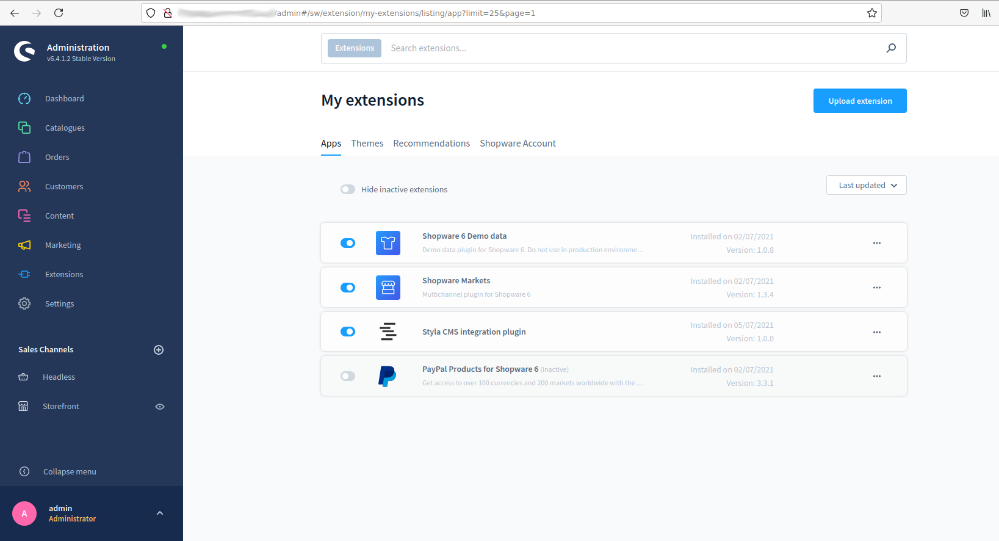
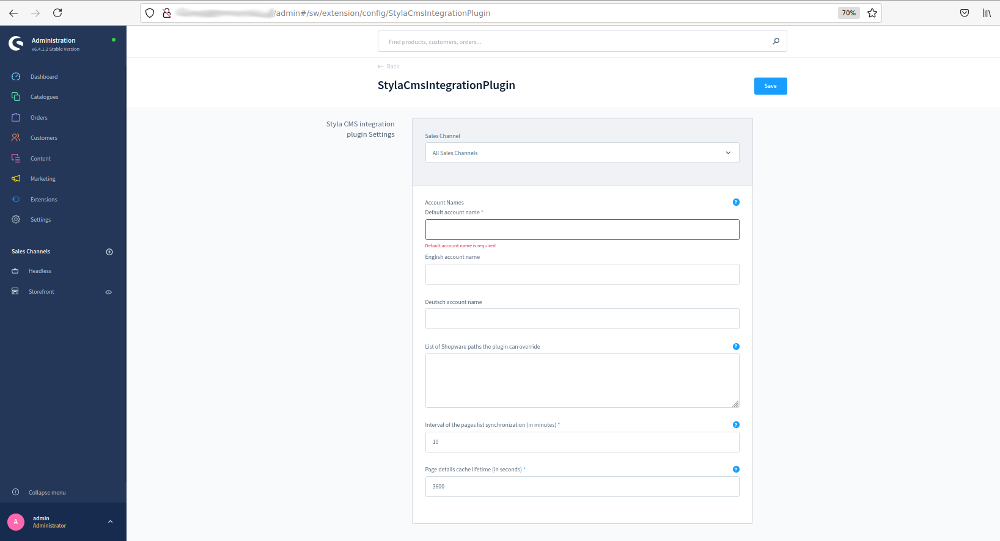

Installation instruction
===============================
***

At the current moment there are two possible approaches to install Styla CMS integration plugin
for your shopware 6 instance: installation from the Shopware 6 administration UI and installation from 
server's command line. Please check detailed description below

### Installation from the Shopware 6 administration UI

1. Download Plugin source code as a zip archive from the GitHub site
2. Install Shopware 6 Application if not installed
3. Open Administration UI
4. Follow to the "My Extensions" page
  
5. Click "Upload extension" button at the top right corner of the page and upload your previously downloaded plugin source code archive
  
6. After this step "My Extensions" page will be reloaded and new plugin will appear in the list. If you do not see it in the list, 
  please check that you "Hide inactive extensions" switcher is off
  
7. If everything works fine so far then press "Install app" link in the "Styla CMS integration plugin" extension row
8. After few reloads of the page you should see that the "Styla CMS integration plugin" is already installed but inactive
  
9. Now we need to activate and configure it, so press to the activation switcher on the
plugin row and wait for page reloading
  
10. After page reloaded, open three dots menu of the "Styla CMS integration plugin" extension and press on the
  "Configuration" link, you will be redirected to the plugin configuration page
  
11. The only mandatory setting is the "Default account name" it required to set it to the existing "Styla" account
in order for the plugin to work properly, so we need to fill this configuration with an account name and press "Save" button
12. At this point everything should be installed, so after some time plugin should synchronize your styla pages with the 
  shopware (check "Content/Styla CMS/Styla Pages" Shopware menu)
  

### Installation from the server's command line

1. Install Shopware 6 Application if not installed
2. Open application root directory and execute next commands:
* composer require "styla/cms-integration"
* bin/console plugin:refresh
3. If everything works fine so far you should see similar row in the output

```
  --------------------------- -------------------------------- --------- ----------------- ------------- ----------- -------- ------------- 
  Plugin                      Label                            Version   Upgrade version   Author        Installed   Active   Upgradeable  
 --------------------------- -------------------------------- --------- ----------------- ------------- ----------- -------- ------------- 
  StylaCmsIntegrationPlugin   Styla CMS integration plugin     1.0.0                                     No          No       No           
      
```
4. Execute next command `bin/console plugin:install --activate StylaCmsIntegrationPlugin` then continue from 
   the point 10 of the first approach description
